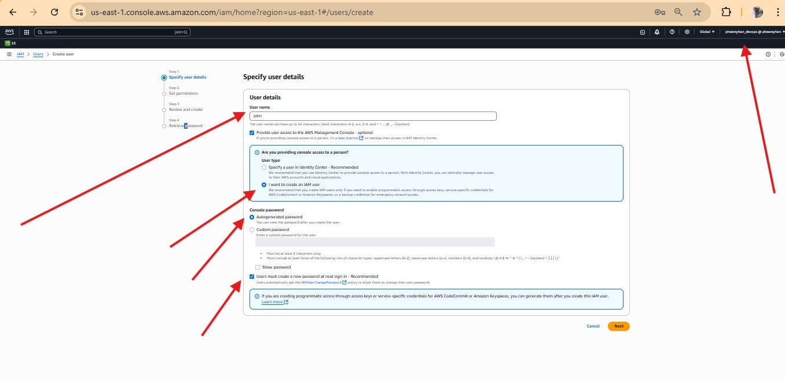
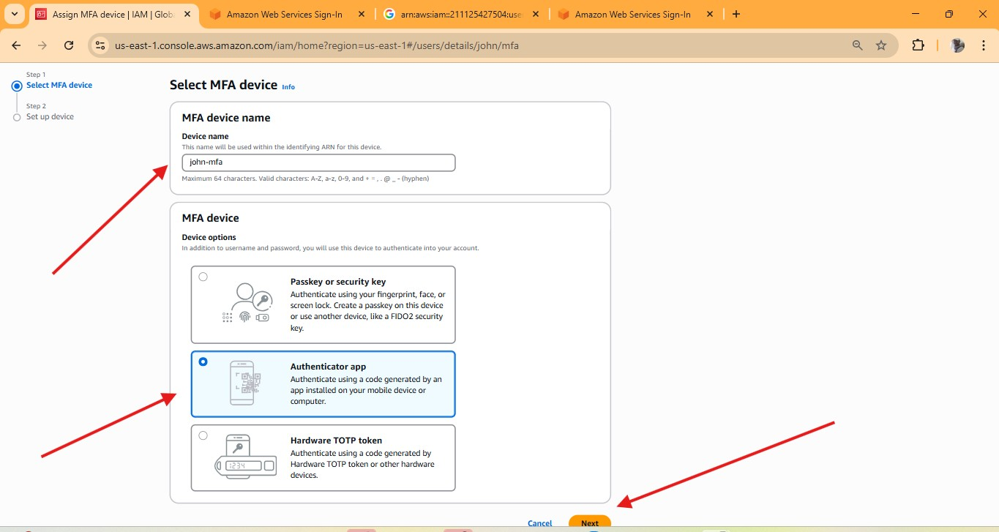
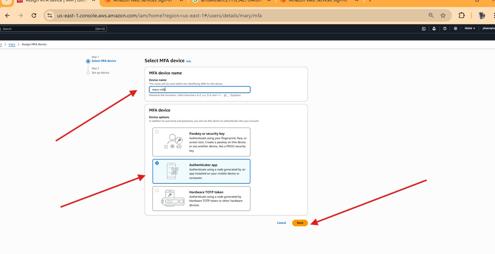

#   Capstone Project Bash Scripting for Multiplication Table 

## Readme URL Below: 

https://github.com/Agbedeyisegun/3mtt-project/blob/main/darey.io/security-and-identity-management-iam
/README.md

## Below are the screenshots of the steps.

- Step 1 
Screenshot of aws console in iam page with created policy called "developers" in ec2 with full access for all resources for the developers Team in a fintech company named Zappy e-Bank in other to ensure policy base environment for the organisation cloud infrastucture setup. 

- Step 2 
Screenshot of aws console in iam page with created group called "Development Team" in the fintech company named Zappy e-Bank in other to ensure group permission base environment for the organisation cloud infrastucture setup. 

- Step 3 
Screenshot of aws console in iam page with created policy called "analyst-policy" in s3 Bucket with full access for all resources for the Analyst Team in a fintech company named Zappy e-Bank in other to ensure policy base environment for the organisation cloud infrastucture setup. 

- Step 4 
Screenshot of aws console in iam page with created group called "Analyst Team" in the fintech company named Zappy e-Bank in other to ensure group permission base environment for the organisation cloud infrastucture setup. 

- Step 5 
Screenshot of a creation of a user called john to be added to the "Development Team" in other to ensure group permission base environment for the organisation cloud infrastucture setup. 

- Step 6 
Screenshot of review of user called john to be added to the "Development Team" 

- Step 7 
Screenshot of successful creation of the user called john to be added to the "Development Team" with auto-generation password set with  download password file creation. 

- Step 8 
Screenshot of successful creation of the user called john added to the "Development Team"  and "developers" policy. 

- Step 9 
Screenshot of a creation of a user called mary to be added to the "Analyst Team" in other to ensure group permission base environment for the organisation cloud infrastucture setup. 

- Step 10 
Screenshot of review of user called mary to be added to the "Analyst Team" 

- Step 11 
Screenshot of successful creation of the user called mary to be added to the "Analyst Team" with auto-generation password set with  download password file creation. 

- Step 12 
Screenshot of successful creation of the user called mary added to the "Analyst Team"  and "Analyst-policy" policy. 

- Step 13 
Screenshot of aws with user john trying to login with his auto-generated password as one of the developers employed to with the "Development Team" that have "developers" policy attached to his role in Zappy e-Bank. 

- Step 14 
Screenshot of aws with user john with force password changed for the first time of login to the platform as developer.

- Step 15 
Screenshot of aws with user john with force password changed successfully.

 

- Step 16

Screenshot of aws with user john logged in to the console successfully after chnaging the password.

- Step 17

Screenshot of aws with main user activate mfa to increase the security of the user called john in other to reduce access to fictious access to the system.

- Step 18

Screenshot of aws with main user using google aunthenticator already installed on the user john
's phone for authenticating his access to the company
's plaform on aws.

- Step 19

Screenshot of aws with main user added google aunthenticator successfully for user john.

- Step 20

Screenshot of aws with main user activate mfa to increase the security of the user called mary in other to reduce access to fictious access to the system.

- Step 21

Screenshot of aws with main user using google aunthenticator already installed on the user mary
's phone for authenticating his access to the company
's plaform on aws.

- Step 22

Screenshot of aws with main user added google aunthenticator successfully for user mary.

- Step 23

Screenshot of aws user john login page trying to test his access to ec2 instance that was given access to on the company's platform to be able to create an application to float the company's website and edit it. He created an instance called "production-app" and it is running successfully as expected.

- Step 24

Screenshot of aws user john login page trying to test his access if it will work on resources that he did not have access to  which is s3 storage bucket as it is out of his job purview and he got access denied, when trying to create a storage bucket as expected.

- Step 25

Screenshot of aws with user called mary showing the mfa activated for her during login in other to reduce fictious access to the system.

- Step 26 
Screenshot of aws with user mary with force password changed for the first time of login to the platform as analyst.

- Step 27

Screenshot of aws user mary login page trying to test her access to s3 storage bucket that was given access to on the company's platform to be able to create a storage for the company's website database to store data and edit it. She created storage called "production-database" and it is was successful as expected.

- Step 28

Screenshot of aws user mary login page trying to test her access to s3 storage bucket that was given access to edit and delete it. She deleted "production-database" successful as expected.

- Step 29

Screenshot of aws user mary login page trying to test her access if it will work on resources that he did not have access to  which is ec2 as it is out of his job purview and he got access denied, when trying to create an instance as expected.

THE PROJECT REFLECTION:

1. Role of IAM in AWS
IAM (Identity and Access Management) is a fundamental AWS service that helps you:
- Securely control access to AWS services and resources.
- Authenticate users and services (who are you? ROLE).
- Authorize actions (what are you allowed to do? PERMISSION).
AWS Process:
- Use IAM to create users, groups, and roles.
- Assign policies to define permissions.
- Monitor access with CloudTrail and IAM Access Analyzer.

2. IAM Users vs. IAM Groups
- IAM User: Represents a single person or application with credentials (username/password or access keys).
- IAM Group: A collection of users with shared permissions.
AWS Process:
- Create a user for each individual (e.g., john, mary) and you can even create the user in a way to differentiate user aside the name like john_dev and mary_analyst.
- Create groups like development Team, Analysts Team, and assign policies to the group.
- Add users to groups to inherit permissions.
Example:
- John (developer) → IAM user in Developers group.
- Mary (analyst) → IAM user in Analysts group.

3. Creating IAM Policies
IAM policies are JSON documents that define what actions are allowed or denied on which resources.
AWS Process:
- Go to IAM > Policies > Create Policy.
- Use the Visual Editor or JSON to define permissions.
- Specify:
- Service (e.g., S3, EC2)
- Actions (e.g., s3:GetObject)
- Resources (e.g., specific bucket)
- Review and create the policy.
- Attach it to a user, group, or role.

4. Principle of Least Privilege
This means only granting the minimum permissions necessary to perform a task.
Why it matters:
- Reduces risk of accidental or malicious misuse.
- Limits the blast radius of compromised credentials.
AWS Practice:
- Start with no permissions.
- Add only what’s needed.
- Regularly audit and refine policies.

5. Scenario: John (Developer) & Mary (Analyst)

IAM Setup Example: 

| Person | IAM User     | Group        | Policy Attached       | Reason    

| John   | john_dev     | Developers   | Full access to EC2    | Needs deploy and manage ec2       

| Mary   | mary_analyst | Analysts     | Full access to S3     | Needs to analyze data and modify it 

Alignment with Least Privilege:
- John can’t access data analytics tools.
- Mary can’t launch or modify EC2 instances.

